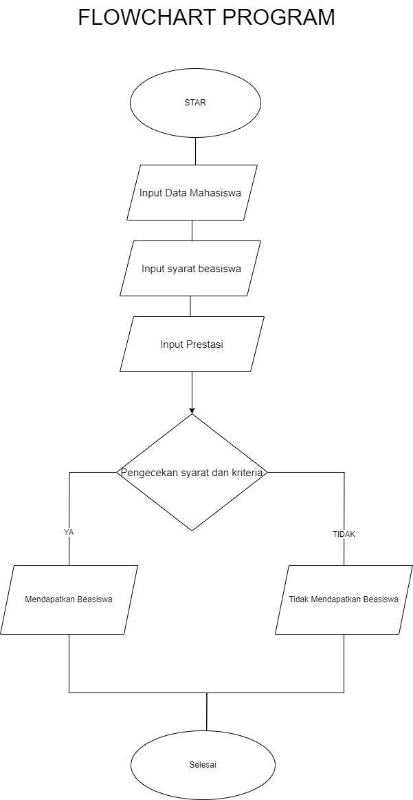

# # PROGRAM BEASISWA MAHASISWA

# STUDI KASUS 
program beasiswa"Cerdas Berprestasi" di luncurkan oleh sebuah universitas swasta di indonesia dengan tujuan untuk mendukung mahasiswa berprestasi dari latar belakang ekonomi kurang mampu.program ini bertujuan untuk meningkatkan akses pendidikan tinggi dan mendorong keberagaman di kampus 

## Program harus memenuhi input berupa:
Data Mahasiswa:
1. Nama
2. Nim
3. Prodi
4. Ipk
5. No Hp

## Syarat Mendapatkan Beasiswa
Syarat:
1. Memenangkan lomba 
2. Mendapatkan prestasi
3. bisa berbahasa jepang

# Kriteria
1. Ipk >= 3.4
2. memenangkan lomba 
3. bisa berbahasa jepang
4. memiliki prestasi akademik

jika mahasiswa memenuhi kriteria tersebut,program akan mencetak nama, nim, prodi ipk,no hp,lomba hasil bahwa mahasiswa tersebut memenuhi syarat untuk mendapatkan beasiswa. jika mahasiswa tersebut memenuhi kriteria, dan jika tidak program akan mencetak pesan yang sesuai 

# FLOWCHART

